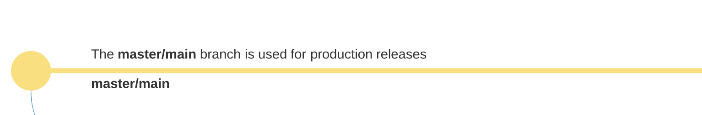
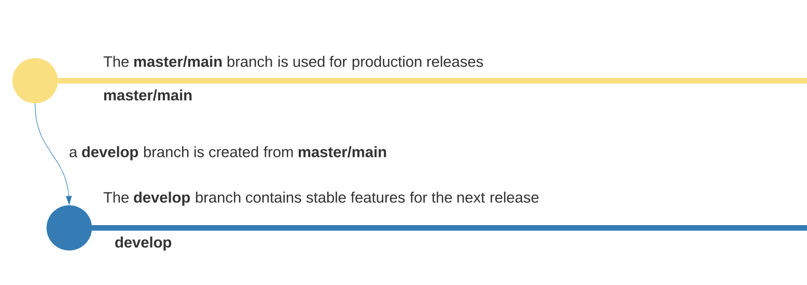
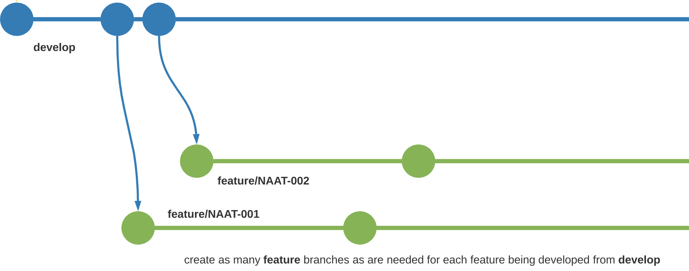
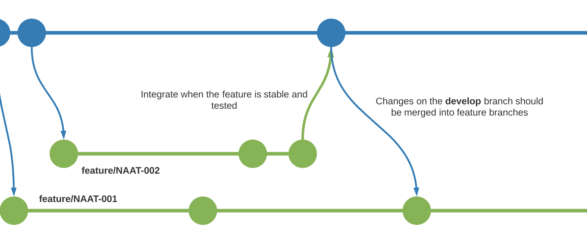
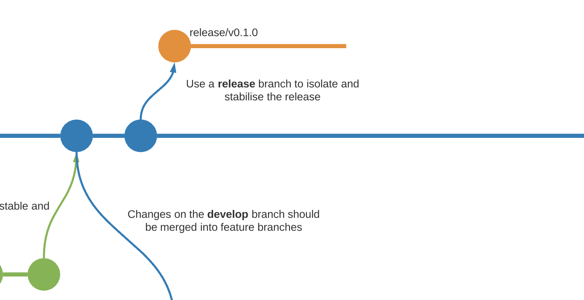
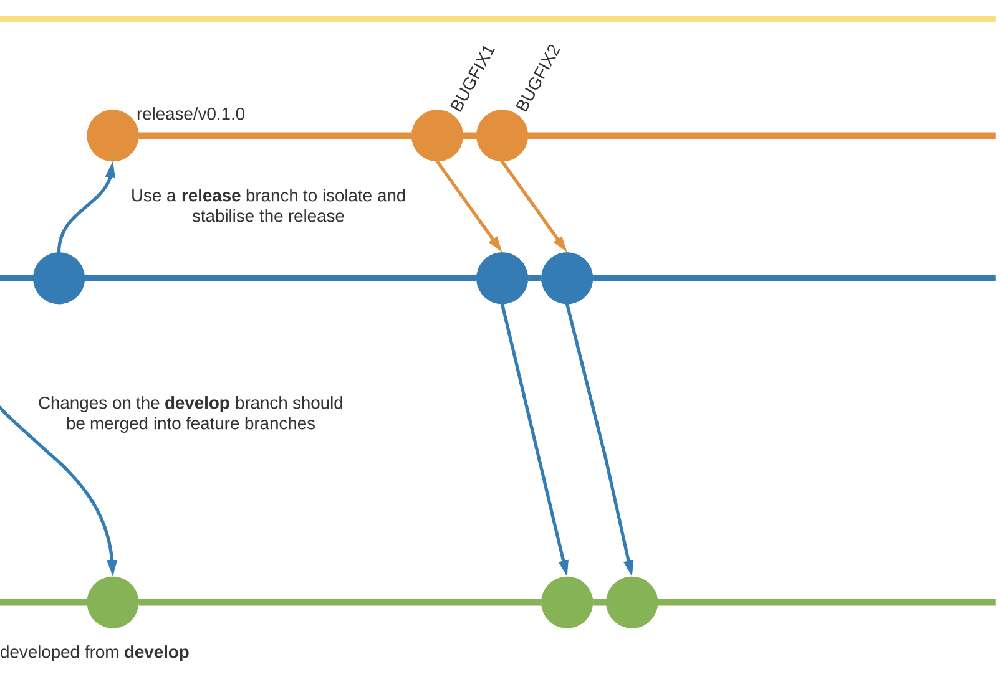
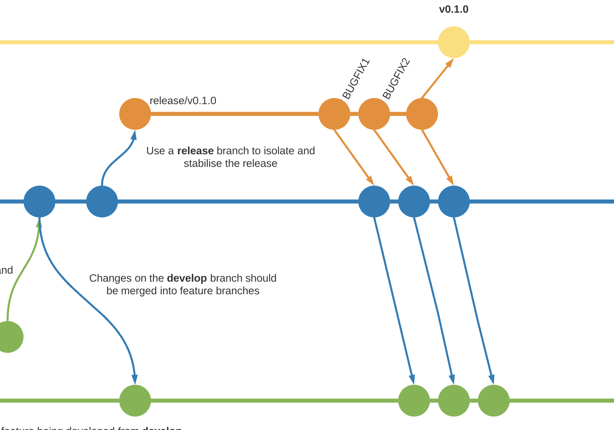
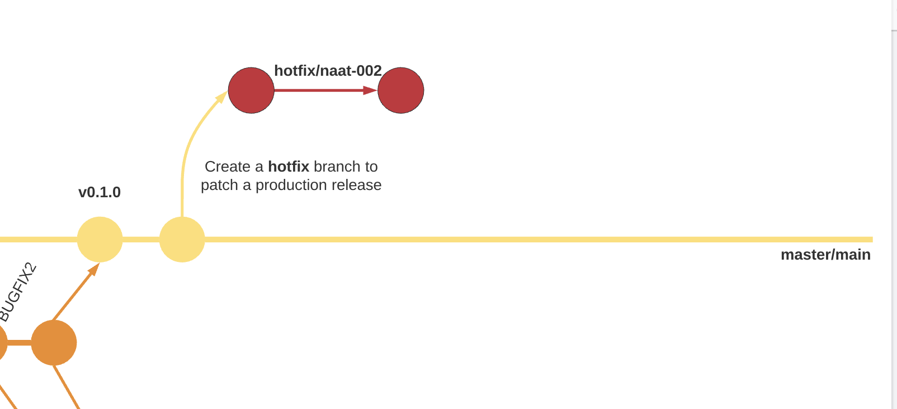
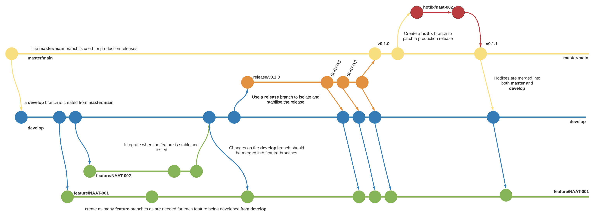

# Development Workflow using Git and GitHub

## Main branches

At the core, the development model is greatly inspired by existing models out there. The central repo holds two main branches with an infinite lifetime:

The `master` branch at origin should be familiar to every Git user. Parallel to the `master` branch, another branch exists called `develop`.

We consider `origin/master` to be the main branch where the source code of `HEAD` always reflects a _production-ready state_.



A `develop` branch is created from `master`. We consider `origin/develop` to be the main branch where the source code of HEAD always reflects a state with the _latest delivered development changes_ for the _next release._ Some would call this the _integration branch_. This is where any automatic nightly builds are built from.



## Feature branches

`Feature` branches will be used to develop new features for upcoming or a distant future release. When starting development of a `feature`, the target release in which this feature will be incorporated may well be unknown at that point. The essence of a feature branch is that it exists as long as the feature is in development, but will eventually be merged back into develop (to definitely add the new feature to the upcoming release) or discarded (in case of a disappointing experiment).

- Must branch off from: `develop`
- Must merge back into: `develop`
- Branch naming convention: `feature/xxx`



### Creating a feature branch

When starting work on a new feature, branch off from the develop branch.

```bash
$ git checkout -b feature/xxx develop
Switched to a new branch "feature/xxx"
```

### Merging feature branches into develop

The `--no-ff` flag must be used in the PR to always create a new commit object, even if the merge could be performed with a fast-forward. This avoids losing information about the historical existence of a feature branch and groups together all commits that together added the feature.

Once a `feature` has been merged into the development branch, other feature branches should merge `develop` into their respective feature branch.



## Release branches

Release branches support preparation of a new production release. They allow for last-minute dotting of i’s and crossing t’s. Furthermore, they allow for minor bug fixes and preparing meta-data for a release (version number, build dates, etc.). By doing all of this work on a release branch, the develop branch is cleared to receive features for the next big release.

- Must branch off from: develop
- Must merge back into: develop and master / develop then is merging into any in-progress releases.
- Branch naming convention: release/<semantic version number>

The key moment to branch off a new `release` branch from `develop` is when `develop` (almost) reflects the desired state of the new `release`. At least all features that are targeted for the release-to-be-built must be merged into develop at this point in time. All features targeted at future releases may not—they must wait until after the `release` branch is branched off.



It is exactly at the start of a `release` branch that the upcoming `release` gets assigned a version number—not any earlier. Up until that moment, the `develop` branch reflected changes for the “next release”, but it is unclear whether that “next release” will eventually become 0.3 or 1.0, until the `release` branch is started. That decision is made on the start of the `release` branch and is carried out by the project’s rules on version number bumping.

This new branch may exist there for a while, until the release may be rolled out definitely. During that time, bug fixes are applied in this branch, which are then merged into the develop branch. Adding large new features here is _strictly prohibited_, these must be merged into develop, and therefore, wait for the next big release.



When the state of the release branch is ready to become a real release, some actions need to be carried out. First, the release branch is merged into master (since every commit on master is a new release by definition, remember). Next, that commit on master must be tagged for easy future reference to this historical version. Finally, the changes made on the release branch need to be merged back into develop, so that future releases also contain these bug fixes.



## HotFix branches

Hotfix branches are very much like release branches in that they are also meant to prepare for a new production release, albeit unplanned. They arise from the necessity to act immediately upon any undesired state of a live production version. When a critical bug in a production version must be resolved immediately, a hotfix branch should be branched off from the corresponding tag on the master branch that marks the production version.

- May branch off from: master
- Must merge back into: develop and master
- Branch naming convention: hotfix/xxx



The allows team members to continue to work on the `develop` branch, while another person is preparing a quick production fix.

When finished, the bugfix needs to be merged back into `master`, but also needs to be merged back into `develop`, in order to _safeguard_ that the bugfix is _included_ in the _next release_ as well. This is completely similar to how release branches are finished.


## Summary

The complete process described above as a single diagram.


