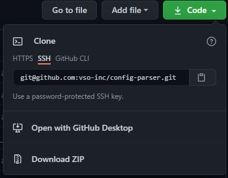

On GitHub, navigate to the main page of the [`repository`](https://github.com/b-skwad/duckview).  Under the repository name, click green `Code` button.




To clone the repository, click Use SSH, then click the copy button.

Open a Ubuntu(tm) Terminal, and create a new filesystem in `~/dev/apps/`, change the current working directory to the `~/dev/apps/` directory, and clone the repository from GitHub.

```bash
me@my-pc ~$ mkdir -p ~/dev/apps
me@my-pc ~$ cd ~/dev/apps
me@my-pc ~/dev/apps$ git clone git@github.com:b-skwad/duckview.git
Cloning into 'duckview'...
remote: Enumerating objects: 20, done.
remote: Counting objects: 100% (20/20), done.
remote: Compressing objects: 100% (18/18), done.
remote: Total 20 (delta 0), reused 0 (delta 0), pack-reused 0
Receiving objects: 100% (20/20), 6.04 KiB | 3.02 MiB/s, done.
```

Change into the new file system `~/dev/apps/duckview`, and validate connectivity back to the duckview GitHub repository.

```bash
me@my-pc ~/dev/apps$ cd duckview
me@my-pc ~/dev/apps/duckview$ git remote -v
origin  git@github.com:b-skwad/duckview.git (fetch)
origin  git@github.com:b-skwad/duckview.git (push)
me@my-pc ~/dev/apps/duckview$
```

The repository has been cloned and can now see the GitHub Repo as a remote `origin`.  Steps 4, 5, and 6 can be repeated on any computer that has been configured to work with GitHub.
