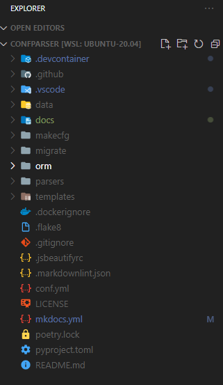
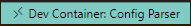
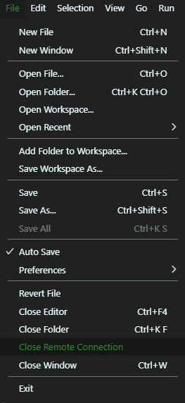
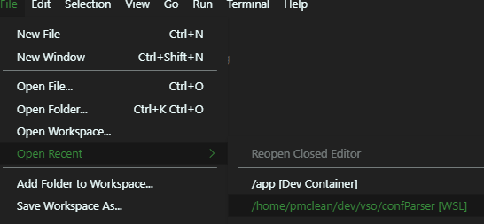

In this example, we are working with the `duckview` example project.

## Opening the project in Visual Studio Code for the first time

Open your Ubuntu(tm) Terminal and navigate to the project folder `~/dev/apps/duckview`. Then type `code .` to open the project.

```bash
me@my-pc ~$ cd ~/dev/apps/duckview
me@my-pc ~/dev/apps/duckview$ code .
me@my-pc ~/dev/apps/duckview$
```

The project will load in VSC.



## Starting the Development Container

Once loaded, click on the small green Icon on the bottom left hand corner of the Visual Studio Code. 

This will make the remote select dropdown appear.


Chose **Remote-Containers: Reopen in Container**.

The project will now open in the development docker container. The green icon will switch from  to saying **Opening Remote...**.


The first time opening this container on your machine will take a while, as the required development images need to be downloaded from Docker Hub, to build the container. I suggest a coffee, or maybe a 15 nap.

The container will be fully loaded and ready to use when the icon in the bottom left switches from **Opening Remote** to **Dev Container: F&#10036;&#10036;&#10036; Parser** as shown.



We can now test that the container is up and running by opening a terminal within VSC. To open a new terminal in VSCode on Windows, press ++ctrl+shift+"&apos;"++  or ++ctrl+"&apos;"++

The command prompt of the new terminal will read:

``` bash
╭─vscode@duckview /app  ‹develop›
╰─➤
```

`<develop>` references your current git branch.  This is the branch from which you will create feature branches.

## Closing the project

In the menu-bar, click **File -> Close Remote Connection**, this stops the development container.



You can now close Visual Studio Code.

## Re-opening the project

After you have opened the project for the first time, subsequent opening is simply done by clicking **File -> Open Recent** then clicking on `/home/<your name>/dev/apps/duckview [WSL]`



Ensure that `[WSL]` at the end of the folder name.

Then [restart](#starting-the-development-container) the development container, as normal.
